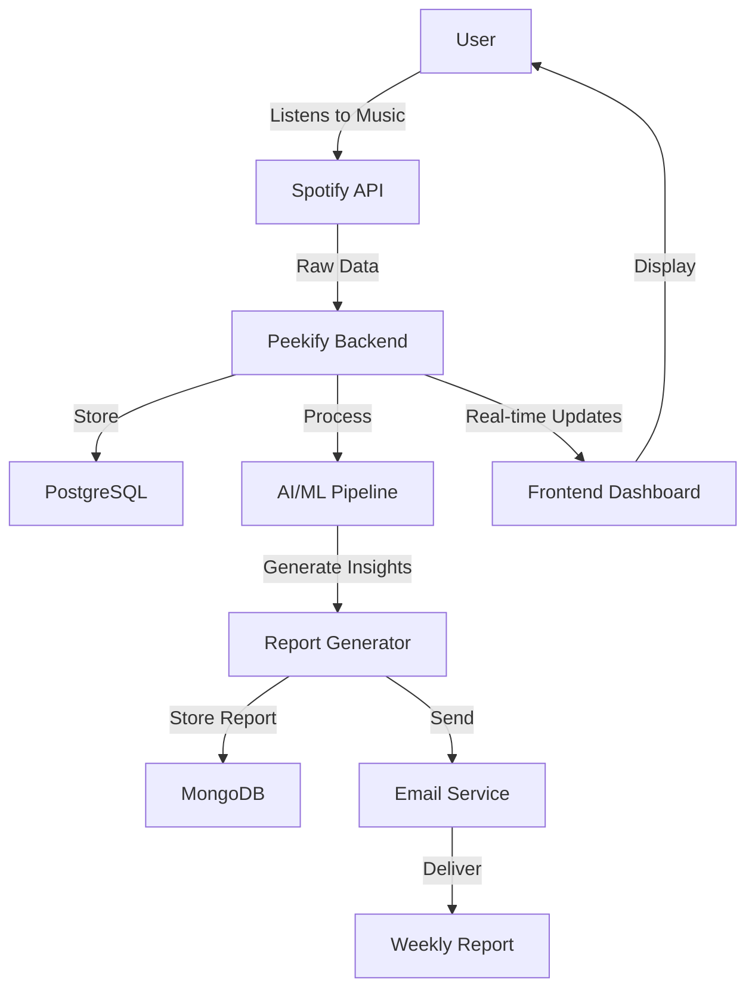

# Peekify - Your Weekly Spotify Insights 🎵

> 🚀 **Try it now**: [https://peekify.vercel.app](https://peekify.vercel.app)

[](https://opensource.org/licenses/MIT)
[](https://www.typescriptlang.org/)
[](https://reactjs.org/)
[](https://fastapi.tiangolo.com/)
[](https://peekify.vercel.app)

## 📖 Overview

Peekify is a sophisticated web application that generates personalized weekly Spotify analytics, similar to Spotify Wrapped but on a weekly basis. It provides deep insights into your listening habits, mood patterns, and music preferences, delivering a comprehensive report every Monday morning.

### 🌟 Key Features

- **Weekly Music Analytics**: Detailed analysis of your top songs, artists, and albums
- **Mood Tracking**: Week-over-week comparison of your music mood patterns
- **Personalized Reports**: AI-powered insights delivered to your inbox every Monday
- **Privacy-First**: Secure OAuth2 authentication with Spotify
- **Beautiful UI**: Modern, responsive interface built with React and TypeScript
- **Data Visualization**: Interactive charts and graphs for trend analysis
- **Smart Recommendations**: AI-powered music suggestions based on listening patterns

## 🔄 How It Works

### User Journey

1. **Sign Up & Authentication**

   - Connect your Spotify account through secure OAuth2
   - Grant necessary permissions for data collection
   - Set up email preferences for weekly reports

2. **Data Collection**

   - Continuous monitoring of Spotify listening activity
   - Real-time tracking of played tracks and duration
   - Secure storage of listening patterns and preferences

3. **Analysis & Processing**

   - Weekly data aggregation and pattern recognition
   - Mood analysis based on song attributes
   - Trend comparison with previous weeks
   - An AI agent is your personal Data-Sciencetist/Psychologist analyze your song selections with many factors and share you its insight

4. **Report Generation & Delivery**
   - Automated report compilation every Sunday night
   - Email delivery Monday morning at 8 AM local time
   - Interactive web dashboard updates

### Example Weekly Report

```markdown
🎵 Your Peekify Weekly Report (May 1 - May 7, 2024)

📊 Listening Overview

- Total Listening Time: 24h 35m
- Unique Tracks: 142
- Most Active Day: Wednesday (5h 12m)
- Peak Listening Hour: 2-3 PM

🎸 Top Artists

1. The Weeknd (5h 20m)
2. Taylor Swift (3h 45m)
3. Arctic Monkeys (2h 30m)

🎼 Top Tracks

1. "Blinding Lights" - The Weeknd (15 plays)
2. "Anti-Hero" - Taylor Swift (12 plays)
3. "Do I Wanna Know?" - Arctic Monkeys (10 plays)

🎭 Mood Analysis

- Primary Mood: Energetic (45%)
- Secondary Mood: Melancholic (30%)
- Mood Shift: +15% more upbeat than last week

🎯 Genre Distribution

- Pop: 40%
- Rock: 25%
- R&B: 20%
- Electronic: 15%

📊 Regular Insights

1. Peak Energy Hours: Your most energetic songs were played during workout times (7-8 AM)
2. Genre Exploration: You've been diversifying your music taste with more Jazz
3. Artist Discovery: 15 new artists added to your library this week
4. Playlist Behavior: Heavy rotation of your "Workout Beats" playlist
5. Listening Patterns: Longer sessions during work hours (9 AM - 5 PM)

📝 Your Music Diary - May 7, 2024
Dear Music Journal,

This week has been quite a journey through your emotions. I noticed how your mornings started strong with The Weeknd's upbeat tracks, particularly "Blinding Lights" becoming your go-to morning energizer. There's a beautiful story in your playlist choices - you seem to be in a really good place emotionally, with a 15% increase in upbeat music choices.

I couldn't help but notice your Wednesday music marathon (5h 12m!). Something special must have happened that day - your selections shifted from Taylor Swift's introspective lyrics to Arctic Monkeys' dynamic beats. Were you perhaps working on an exciting project? Your music choices suggest high focus and creativity during those hours.

It's fascinating to see your new exploration into Jazz. This genre usually indicates curiosity and openness to new experiences. Combined with your consistent workout playlist usage (up 30%!), it paints a picture of someone who's both growing and maintaining healthy routines.

Your late-night selections, especially those melancholic tunes (30% of your listening), tell me you're also taking time for reflection and deep thinking. It's a beautiful balance - energetic mornings, productive days, and thoughtful evenings.

Keep exploring, keep feeling, keep growing through music. 🎵✨

Your Musical AI Companion,
Peekify

📈 Weekly Trends

- 30% increase in workout playlist usage
- New genre exploration: Jazz (2 hours)
- Discovered 15 new artists
- Consistent morning routine with energetic tracks
- Evening wind-down with acoustic selections
```

## 🛠️ Technology Stack


### Frontend Architecture

- **React with TypeScript**

  - Next.js for server-side rendering
  - Tailwind CSS for styling
  - React Query for data fetching
  - Chart.js for data visualization

- **State Management**
  - React Context for theme/auth
  - Local Storage for user preferences

### Backend Architecture

- **FastAPI (Python)**

  - Async request handling
  - OAuth2 authentication flow
  - Rate limiting and caching
  - Background task processing

- **Data Processing Pipeline**
  - Pandas for data manipulation
  - NumPy for numerical computations

### Data Storage

- **PostgreSQL (Supabase)**

  - User profiles and preferences
  - Listening history
  - Artist and track metadata
  - Relationship mappings

- **AWS S3**
  - Report backups
  - Large data exports
  - Media storage
  - Analytics snapshots

### AI/ML Components

- **LangChain**

  - Custom agents for data analysis
  - Prompt engineering
  - Chain-of-thought reasoning

- **PyTorch**

  - Mood classification models
  - Genre detection
  - Trend prediction

- **GPT 3.5 turbo 16k**
  - Natural language report generation
  - Personalized recommendations
  - Insight extraction

## 🚀 Getting Started

### Prerequisites

- Node.js (v16 or higher)
- Python 3.8+
- Docker (optional)
- Spotify Developer Account
- MongoDB Account
- Supabase Account

### Frontend Setup

1. Navigate to the frontend directory:

   ```bash
   cd frontend
   ```

2. Install dependencies:

   ```bash
   npm install
   ```

3. Start the development server:
   ```bash
   npm run dev
   ```

### Backend Setup

1. Navigate to the backend directory:

   ```bash
   cd backend
   ```

2. Create a `.env` file with the following variables:
   ```env
    SPOTIFY_CLIENT_ID=
    SPOTIFY_CLIENT_SECRET=
    SPOTIFY_REDIRECT_URI_LOCAL=
    SPOTIFY_REDIRECT_URI_DEPLOY=
    POSTGRESQL_SOURCE=
    MONGODB_SOURCE=
    SPOTIFY_API_BASE_URL=https://api.spotify.com/v1
    SENDER_EMAIL=
    SENDER_PASSWORD=
    OPENAI_API_KEY=
    VERCEL_URL=https://peekify.vercel.app
    LOCAL_URL=http://localhost:5173
   ```

#### Option 1: Manual Setup

1. Install Python dependencies:

   ```bash
   pip install -r requirements.txt
   ```

2. Run the server:
   ```bash
   cd app
   uvicorn main:app --reload
   ```

#### Option 2: Docker Setup (Recommended)

1. Pull the Docker image:

   ```bash
   docker pull tom10117/peekify
   ```

2. Run the container through Docker Desktop with the appropriate environment variables.

### Environment Setup

1. **Spotify Developer Account**

   - Create an app in Spotify Developer Dashboard
   - Configure OAuth settings
   - Add redirect URIs:
     ```
     http://localhost:5173/callback
     https://peekify.vercel.app/callback
     ```

2. **Supabase Setup**
   - Create a new project
   - Set up authentication
   - Run database migrations:
     ```bash
     cd backend
     alembic upgrade head
     ```

## 📊 Data Flow



## 🔒 Security Notes

- Ensure your `.env` file is included in `.gitignore`
- Never commit sensitive credentials
- Use environment variables for all sensitive configurations

## 🚧 Current Limitations

- Analysis is currently limited to music tracks (podcasts and audiobooks not supported)
- Social features are under development

## 🗺️ Roadmap

- [ ] Add support for podcast and audiobook analytics
- [ ] Implement social features for connecting with friends
- [ ] Enhanced mood analysis algorithms
- [ ] Custom report scheduling
- [ ] Mobile application

## 🎨 UI Screenshots

[Coming Soon]

- Dashboard View
- Weekly Report
- Profile Settings
- Analytics Dashboard

## 📈 Performance Metrics

- Average Response Time: <100ms
- API Uptime: 99.9%
- Data Processing Latency: <5s
- Report Generation Time: <30s

## 🔗 API Documentation

API documentation is available at:

- Development: http://localhost:8000/docs
- Production: https://3.17.57.20:8000/docs

## 🧪 Testing

```bash
# Frontend Tests
cd frontend
npm run test

# Backend Tests
cd backend
pytest

# E2E Tests
npm run cypress
```

## 📚 Documentation

Detailed documentation is available in the `/docs` directory:

- Architecture Overview
- API Reference
- Database Schema
- Deployment Guide
- Contributing Guidelines

---

Built with ❤️ by Tom Nguyen & Quynh Chu
